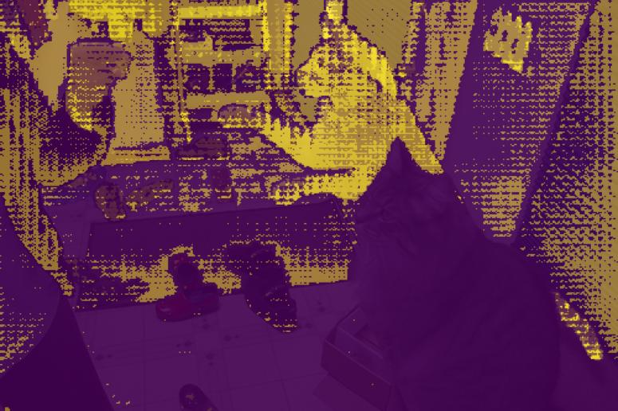
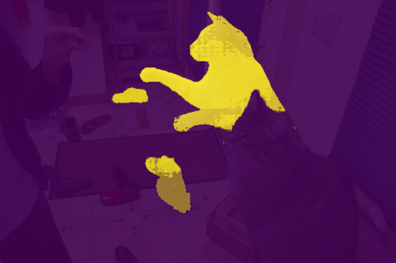
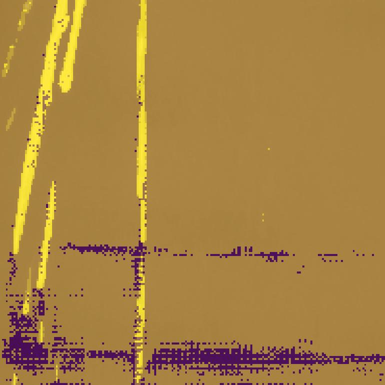

# Transformers - segmentation with sam2

## Overview
This project showcases a **Transformer-based computer vision pipeline** using **SAM 2 (Segment Anything Model)** to transform raw visual data into structured understanding.

The system performs **zero-shot image segmentation** and **prompt-guided segmentation** using spatial inputs (points), demonstrating how modern foundation models can be adapted to real-world perception tasks without task-specific training.

---

## Pipeline

1. Image ingestion and preprocessing (OpenCV)
2. Loading a pretrained **SAM 2 Transformer-based model**
3. Inference modes:
   - **Automatic segmentation (no prompts)** -> (main_no_points.py)
   - **Prompt-based segmentation using spatial cues** ->  (main.py)
4. Mask generation and scoring
5. Overlay visualization for qualitative analysis

---

## Technologies
- OpenCV
- Transformer-based architectures  
- Segment Anything Model (SAM 2)
- NumPy  
- Matplotlib  

---

## Results
In this case, i used the SAM2 version sam2.1_hiera_small. You can find more in the official repository: https://github.com/facebookresearch/sam2

Below are qualitative visual results illustrating how SAM 2 interprets visual scenes, both autonomously and with user guidance.

  
  

  Automatic segmentation &nbsp;&nbsp; | &nbsp;&nbsp; Prompt-guided segmentation

  
  

  Automatic segmentation &nbsp;&nbsp; | &nbsp;&nbsp; Prompt-guided segmentation

---

## Dataset

The system is dataset-agnostic and operates on any image source.

I used the following ones:
- NEU Surface Defect Database from Kaggle: https://www.kaggle.com/datasets/kaustubhdikshit/neu-surface-defect-database
- Coco dataset: https://cocodataset.org/#home

## Future Work

